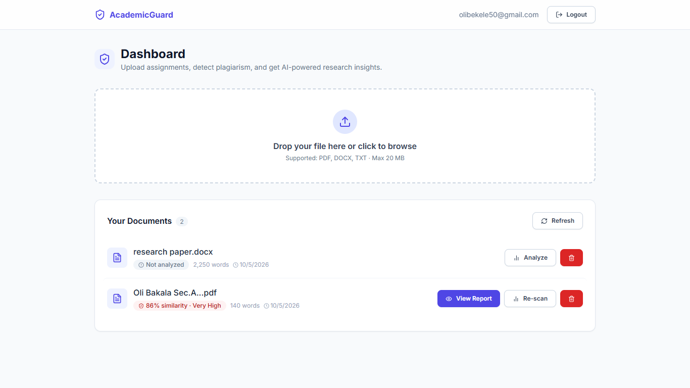
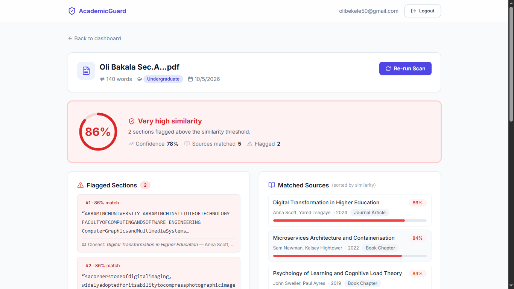

# 🛡️ AcademicGuard — AI Plagiarism Detection

An AI-powered academic integrity platform that uses **Retrieval-Augmented Generation (RAG)**, **pgvector semantic search**, and **LLM analysis** to detect plagiarism and provide research suggestions for student assignments.

---

## 📸 Screenshots

### Dashboard — Upload & Assignment List


### Analysis Report — Similarity Score & Results


---

## 🚀 Overview

Students upload assignments (PDF, DOCX, or plain text). The system:

1. **Extracts text** from the uploaded file
2. **Generates embeddings** using NVIDIA NIM or OpenAI
3. **Searches** a pgvector database of 50 academic sources via native cosine similarity (`<=>` operator with HNSW index)
4. **Detects plagiarism** by comparing text chunks against academic sources
5. **Generates AI insights** — research suggestions, citation recommendations, and academic level assessment
6. **Displays results** in a color-coded similarity report (Turnitin-style)

---

## 🧱 Tech Stack

| Component | Technology |
|---|---|
| **Frontend** | Next.js 14, TypeScript, Tailwind CSS |
| **Backend API** | FastAPI (async), Python 3.11 |
| **ORM / Driver** | SQLAlchemy 2.x (async) + asyncpg |
| **Database** | PostgreSQL 16 + pgvector (HNSW index) |
| **Embeddings** | NVIDIA NIM `nemotron-3-embed-1b` (2048-dim) or OpenAI `text-embedding-3-small` (1536-dim) |
| **LLM** | NVIDIA NIM `nemotron-3-super-120b-a12b` or OpenAI `gpt-4o-mini` |
| **Auth** | JWT (`python-jose`) + bcrypt (`passlib`) |
| **Rate Limiting** | slowapi |
| **Logging** | structlog (JSON in production, coloured console in dev) |
| **Migrations** | Alembic |
| **Testing** | pytest + pytest-asyncio (28 tests, SQLite in-memory) |
| **CI/CD** | GitHub Actions (lint → test → Docker build) |
| **Linting** | Ruff |
| **Automation** | n8n workflow engine |
| **Containerisation** | Docker + Docker Compose |

---

## 🗂️ Project Structure

```
academic-assignment-helper/
├── backend/
│   ├── main.py                  # FastAPI app + lifespan (migrations + seeding)
│   ├── database.py              # Async SQLAlchemy engine + session factory
│   ├── models.py                # ORM: Student, Assignment, AnalysisResult, AcademicSource
│   ├── schemas.py               # Pydantic v2 request/response models
│   ├── auth.py                  # JWT creation + bcrypt password hashing
│   ├── deps.py                  # Shared dependency: get_current_student (Bearer auth)
│   ├── rag_service.py           # RAG pipeline: embed → search → plagiarism → LLM → persist
│   ├── logger.py                # structlog configuration (JSON/console)
│   ├── requirements.txt
│   ├── routes/
│   │   ├── auth_routes.py       # POST /auth/register, /auth/login, GET /auth/me
│   │   ├── upload_routes.py     # POST /upload/ (file upload + text extraction)
│   │   ├── assignment_routes.py # GET /assignments/, GET /{id}, DELETE /{id}
│   │   └── analysis_routes.py   # POST /analysis/start, GET /analysis/{id}
│   └── utils/
│       └── load_sources.py      # Seeds 50 academic sources on startup
├── frontend/
│   ├── app/
│   │   ├── (auth)/login/        # Login page
│   │   ├── (auth)/register/     # Registration page
│   │   ├── dashboard/           # Upload + assignment list + inline analysis status
│   │   └── assignments/[id]/    # Full analysis report (Turnitin-style)
│   ├── components/              # Navbar, UploadZone, PlagiarismGauge
│   └── lib/
│       ├── api.ts               # Typed Axios client with Bearer auth
│       └── auth.ts              # Token storage helpers
├── alembic/
│   ├── env.py                   # Async Alembic config
│   └── versions/
│       ├── 0001_initial_schema.py       # All tables + HNSW index
│       └── 0002_configurable_embedding_dim.py  # Vector column resize
├── tests/
│   ├── conftest.py              # Fixtures: in-memory SQLite, mocked OpenAI
│   ├── test_auth.py             # 8 auth tests
│   ├── test_upload.py           # 4 upload tests
│   ├── test_assignments.py      # 9 CRUD + ownership tests
│   └── test_analysis.py         # 7 analysis tests
├── data/
│   └── sample_academic_sources.json   # 50 academic sources across 10 domains
├── workflows/
│   └── assignment_analysis_workflow.json  # n8n workflow
├── .github/workflows/ci.yml     # GitHub Actions: lint → test → Docker build
├── docker-compose.yml           # 4 services: db, backend, n8n, frontend
├── Dockerfile                   # Backend (slim, optional torch)
├── frontend/Dockerfile          # Frontend (multi-stage Node 20 Alpine)
├── alembic.ini
├── Makefile                     # Dev commands
├── ruff.toml                    # Linter config
├── pytest.ini
├── init.sql                     # Enables pgvector extension
└── .env.example
```

---

## ⚙️ Setup

### 1. Clone the repo

```bash
git clone https://github.com/<your-username>/academic-assignment-helper.git
cd academic-assignment-helper
```

### 2. Configure environment variables

```bash
cp .env.example .env
```

Edit `.env` — choose your LLM provider:

**Option A — NVIDIA NIM (free tier available at [build.nvidia.com](https://build.nvidia.com)):**
```env
LLM_API_KEY=nvapi-your-key-here
LLM_BASE_URL=https://integrate.api.nvidia.com/v1
EMBEDDING_MODEL=nvidia/nemotron-3-embed-1b
OPENAI_COMPLETION_MODEL=nvidia/nemotron-3-super-120b-a12b
EMBEDDING_DIM=2048
```

**Option B — OpenAI:**
```env
LLM_API_KEY=sk-your-key-here
LLM_BASE_URL=https://api.openai.com/v1
EMBEDDING_MODEL=text-embedding-3-small
OPENAI_COMPLETION_MODEL=gpt-4o-mini
EMBEDDING_DIM=1536
```

Generate a JWT secret:
```bash
python -c "import secrets; print(secrets.token_hex(32))"
```

### 3. Build and run

```bash
docker-compose up --build
```

> **Note:** If the DB healthcheck causes issues on Docker Compose v5, start services in two batches:
> ```bash
> docker-compose up -d db n8n
> # wait 30 seconds for DB to initialise
> docker-compose up -d backend frontend
> ```

This starts four services:

| Service | URL | Description |
|---|---|---|
| **Frontend** | http://localhost:3000 | Next.js UI (AcademicGuard dashboard) |
| **Backend API** | http://localhost:8000 | FastAPI |
| **API Docs** | http://localhost:8000/docs | Swagger UI |
| **n8n** | http://localhost:5678 | Automation workflow editor |
| **PostgreSQL** | localhost:5432 | Database + pgvector |

On first startup the backend will:
- Create all database tables (via Alembic or `create_all`)
- Enable the `pgvector` extension
- Seed 50 academic sources with AI-generated embeddings

---

## 📘 API Reference

All protected endpoints require:
```
Authorization: Bearer <access_token>
```

### Authentication

| Method | Path | Auth | Description |
|---|---|---|---|
| `POST` | `/auth/register` | — | Register a new student account |
| `POST` | `/auth/login` | — | Log in, receive JWT |
| `GET` | `/auth/me` | ✅ | Get current student profile |

```http
POST /auth/register
Content-Type: application/json
{ "email": "student@uni.edu", "password": "securepass123", "full_name": "Jane Doe" }

POST /auth/login
Content-Type: application/json
{ "email": "student@uni.edu", "password": "securepass123" }
```

### Assignments

| Method | Path | Auth | Description |
|---|---|---|---|
| `POST` | `/upload/` | ✅ | Upload a PDF/DOCX/TXT file |
| `GET` | `/assignments/` | ✅ | List assignments (paginated) |
| `GET` | `/assignments/{id}` | ✅ | Get assignment detail + analysis summary |
| `DELETE` | `/assignments/{id}` | ✅ | Delete assignment + file + results |

### Analysis

| Method | Path | Auth | Description |
|---|---|---|---|
| `POST` | `/analysis/start` | ✅ | Trigger analysis (single or batch) |
| `GET` | `/analysis/{id}` | ✅ | Get the latest analysis result |

**Analysis result fields:**

| Field | Description |
|---|---|
| `plagiarism_score` | Max cosine similarity (0–1) across all chunks vs. academic sources |
| `flagged_sections` | Chunks exceeding `PLAGIARISM_THRESHOLD` with matched source details |
| `suggested_sources` | Top-K semantically similar academic sources (sorted by score) |
| `research_suggestions` | LLM-generated research improvement recommendations |
| `citation_recommendations` | LLM-generated citation recommendations |
| `confidence_score` | LLM-assessed confidence in the analysis (0–1) |

---

## 🎨 Frontend Features

- **Login / Register** — clean auth pages with form validation
- **Dashboard** — drag-and-drop upload, assignment list with live analysis status badges
  - Color-coded similarity scores (blue/green/amber/orange/red — Turnitin-style)
  - Inline "Analyzing…" state with animated indicators
  - "View Report" and "Re-scan" buttons per assignment
- **Analysis Report** — Turnitin-inspired layout:
  - Large circular similarity score gauge with color-coded ring
  - Summary stats (confidence, sources matched, flagged count)
  - Flagged sections with match percentage and closest source
  - Matched sources sorted by similarity with individual progress bars
  - AI research suggestions and citation recommendations as numbered lists

---

## 🧠 n8n Workflow Setup

1. Open http://localhost:5678
2. Go to **Workflows → Import from file**
3. Import `workflows/assignment_analysis_workflow.json`
4. Set the `BACKEND_SERVICE_TOKEN` environment variable in n8n with a valid student JWT
5. Activate the workflow

The workflow receives `{ assignment_id, student_email }` from the upload route, POSTs to `/analysis/start` with a Bearer token, and branches on success/failure.

---

## 🔒 Security

- JWT tokens passed via `Authorization: Bearer` header (never query params)
- All endpoints enforce student ownership (you can only access your own data)
- Uploaded files namespaced by student ID to prevent collisions
- Files persist across container restarts via named Docker volume (`uploads_data`)
- Rate limiting: 10/min register, 20/min login, 10/min analysis (per IP)
- CORS configurable via `CORS_ORIGINS` env var

---

## 🧪 Development

### Run tests locally

```bash
pip install -r backend/requirements.txt
pytest tests/ -v --cov=backend
```

Tests use an in-memory SQLite database and mocked LLM calls — no Docker, PostgreSQL, or API keys needed.

### Lint and format

```bash
ruff check backend/ tests/      # lint
ruff format backend/ tests/     # auto-format
```

### Makefile commands

```bash
make up        # docker-compose up --build
make down      # docker-compose down
make migrate   # run Alembic migrations
make test      # run pytest in container
make lint      # ruff check
make fmt       # ruff format
```

### CI Pipeline

GitHub Actions (`.github/workflows/ci.yml`) runs on every push/PR:

1. **Lint** — Ruff linter + formatter check
2. **Test** — pytest with coverage report (SQLite, no Docker needed)
3. **Docker Build** — smoke test that the backend image builds successfully

---

## ⚠️ Common Issues

| Problem | Cause | Fix |
|---|---|---|
| `410 Gone` from NVIDIA | Model reached end-of-life | Check available models at build.nvidia.com, update `EMBEDDING_MODEL` |
| `429 Too Many Requests` | API rate limit | Reduce `RAG_MAX_CHUNKS` or use a paid-tier key |
| `500` on `/analysis/start` | No text extracted from file | Ensure the file is not a scanned image PDF |
| `401 Unauthorized` | Missing or expired token | Re-login at `/auth/login` |
| No sources seeded | API key missing or invalid | Check `LLM_API_KEY` in `.env`, restart backend |
| DB unhealthy on startup | Docker Compose v5 healthcheck timing | Start `db n8n` first, then `backend frontend` after 30s |
| Embedding dimension mismatch | Changed model but didn't update `EMBEDDING_DIM` | Set `EMBEDDING_DIM` to match your model, wipe DB volume, restart |
| n8n can't reach backend | Wrong URL in workflow | Use `http://backend:8000` (Docker network), not `localhost` |

---

## 📚 Future Improvements

- 🔒 Instructor / admin role with RBAC
- 📊 Analytics dashboard for plagiarism statistics
- 🔁 Webhook retry queue for failed n8n triggers
- 📈 Larger academic source database (arXiv, Semantic Scholar API)
- 🤖 AI-generated content detection (beyond similarity matching)

---

## 👨‍💻 Author

Oli Bakala — Software Engineer
